# AI MCP Chatbot Platform

## 1. Present Problem

Traditional AI chatbots are often built as tightly coupled, monolithic systems where conversation logic, external integrations, and business workflows live inside a single backend. This approach introduces several limitations:

* Adding new integrations (Gmail, Calendar, Slack, etc.) requires backend rewrites
* Tool logic is tightly bound to application code, reducing maintainability
* Poor handling of long-running or multi-step workflows
* Limited context reuse across conversations and tools
* Difficult to scale or isolate failures per integration
* Hard to extend toward agent-based or enterprise-grade workflows

As AI systems grow beyond simple Q&A into real-world task execution, these limitations become blockers for scalability, reliability, and extensibility.

---

## 2. Proposed Solution

We propose an **MCP (Model Context Protocol)–based AI chatbot architecture** that cleanly separates reasoning, orchestration, and tool execution.

Key ideas:

* A **tool-agnostic chatbot client** that never embeds tool logic
* A **backend orchestrator** responsible for context, sessions, and workflows
* Multiple **independent MCP servers**, each exposing a focused set of tools
* Standardized communication using **JSON-RPC via MCP**
* Support for **multi-agent reasoning** and **Context-Augmented Generation (CAG)**

This design allows us to add, remove, or scale tools without impacting the core chatbot logic, while enabling complex multi-step workflows across tools.

---

## 3. Architecture Overview (Simplified MCP-First Design)

Instead of running many standalone MCP servers per tool, this system follows a **simplified and practical architecture** where all tools are organized inside a single **`mcp_tools/` folder** and exposed through one MCP server interface.

This approach reduces operational overhead while still following MCP best practices.

### Core Components

* **Frontend Chatbot (React + TypeScript)**
  Real-time chat UI that streams responses and displays tool execution status.

* **Backend Orchestrator (FastAPI)**
  Acts as the MCP host and central brain:

  * Maintains conversation state and user context
  * Invokes the LLM with available tools
  * Routes tool calls via MCP

* **MCP Tools Layer (`mcp_tools/`)**
  A structured folder containing all tool implementations:

  * Gmail tools
  * Calendar tools
  * Slack tools
  * PDF tools

  Each tool follows MCP schemas and is registered dynamically with the MCP server.

* **LLM Layer**
  Responsible for intent recognition, tool selection, and response generation.

### Architecture Diagram

```mermaid
graph TB
    subgraph "Client Layer"
        U[👤 User]
        FE["🖥️ Frontend<br/>React + TypeScript<br/><br/>• Real-time chat UI<br/>• Streaming responses<br/>• Tool execution status"]
    end

    subgraph "Backend Layer"
        BE["⚙️ Backend Orchestrator<br/>FastAPI + MCP Host<br/><br/>• Session management<br/>• Context storage<br/>• MCP protocol handler<br/>• Request routing"]
        
        LLM["🧠 LLM Engine<br/>GPT-4 / Claude<br/><br/>• Intent recognition<br/>• Tool selection<br/>• Response generation<br/>• Multi-agent reasoning"]
    end

    subgraph "MCP Protocol Layer"
        MCP["📡 MCP Server<br/>JSON-RPC Interface<br/><br/>• Tool registration<br/>• Schema validation<br/>• Request/Response handling"]
    end

    subgraph "Tools Layer - mcp_tools/"
        GMAIL["📧 Gmail Tools<br/>• send_email<br/>• read_inbox<br/>• create_draft"]
        CAL["📅 Calendar Tools<br/>• create_event<br/>• list_events<br/>• update_event"]
        SLACK["💬 Slack Tools<br/>• send_message<br/>• list_channels<br/>• post_thread"]
        PDF["📄 PDF Tools<br/>• extract_text<br/>• generate_pdf<br/>• merge_pdfs"]
    end

    subgraph "External Services"
        GAPI["Gmail API"]
        CAPI["Google Calendar API"]
        SAPI["Slack API"]
        PAPI["PDF Libraries"]
    end

    %% User to Frontend
    U -->|"User Input"| FE
    FE -->|"Display Response"| U

    %% Frontend to Backend
    FE -->|"HTTP/WebSocket<br/>Chat Request"| BE
    BE -->|"Streaming Response<br/>Tool Status"| FE

    %% Backend to LLM
    BE -->|"User Intent +<br/>Available Tools"| LLM
    LLM -->|"Selected Tools +<br/>Parameters"| BE

    %% Backend to MCP
    BE -->|"Tool Call Request<br/>JSON-RPC"| MCP
    MCP -->|"Tool Result<br/>JSON-RPC"| BE

    %% MCP to Tools
    MCP -->|"Invoke Tool"| GMAIL
    MCP -->|"Invoke Tool"| CAL
    MCP -->|"Invoke Tool"| SLACK
    MCP -->|"Invoke Tool"| PDF

    GMAIL -->|"Result"| MCP
    CAL -->|"Result"| MCP
    SLACK -->|"Result"| MCP
    PDF -->|"Result"| MCP

    %% Tools to External APIs
    GMAIL <-->|"OAuth 2.0"| GAPI
    CAL <-->|"OAuth 2.0"| CAPI
    SLACK <-->|"OAuth 2.0"| SAPI
    PDF <-->|"Local Processing"| PAPI

    %% Styling
    classDef frontend fill:#e1f5ff,stroke:#01579b,stroke-width:2px
    classDef backend fill:#fff3e0,stroke:#e65100,stroke-width:2px
    classDef mcp fill:#f3e5f5,stroke:#4a148c,stroke-width:2px
    classDef tools fill:#e8f5e9,stroke:#1b5e20,stroke-width:2px
    classDef external fill:#fce4ec,stroke:#880e4f,stroke-width:2px

    class U,FE frontend
    class BE,LLM backend
    class MCP mcp
    class GMAIL,CAL,SLACK,PDF tools
    class GAPI,CAPI,SAPI,PAPI external
```



### High-Level Flow

```
User
 → Frontend (Chat UI)
 → Backend (FastAPI + MCP Host)
 → LLM (Intent + Tool Selection)
 → MCP Tools (gmail, calendar, slack, pdf)
 → External APIs
 → Tool Result
 → LLM (Response Formatting)
 → User
```

### Why This Architecture

* Fewer moving parts compared to many isolated servers
* Easier local development and debugging
* Still MCP-compliant and tool-agnostic
* Can later split tools into separate MCP servers if scale demands

---

## 4. Backend and MCP Integration

The backend is implemented using **Python + FastAPI** and runs the MCP server.

### Responsibilities

* Real-time request handling
* Maintaining user and session context
* Providing available tool metadata to the LLM
* Routing tool calls via MCP JSON-RPC
* Streaming partial responses to the frontend

The backend does not directly call external APIs. All external communication happens through MCP tools.

### Real-Time Execution Model

* User input is streamed to the backend
* LLM processes intent and selects tools
* Tool calls are executed synchronously where possible
* Results are streamed back to the user

This enables a **real-time conversational experience** without blocking the UI.

## 5. MCP Tools Implementation (Best Practice)

All tools are implemented inside a dedicated **`mcp_tools/` directory** and registered with the MCP server at runtime.

### Recommended Folder Structure

```
mcp_tools/
 ├── gmail_tools.py
 ├── calendar_tools.py
 ├── slack_tools.py
 ├── pdf_tools.py
 ├── schemas.py
 └── __init__.py
```

### Best Practices for Tool Design

* Each tool performs **one clear action** (single responsibility)
* No business logic inside the LLM or frontend
* OAuth and API credentials handled inside the tool layer
* Tools expose clear input/output schemas
* Tools remain stateless; context is passed explicitly

This design keeps tools predictable, testable, and reusable.

---

## 6. Multi-Agent Architecture

The system uses multiple specialized agents to improve reasoning quality and reliability.

### Agents

* **Planner Agent**: breaks user intent into ordered steps
* **Tool Selection Agent**: selects appropriate MCP tools
* **Execution Agent**: executes tools with retries and validation
* **Response Agent**: converts tool outputs into user-friendly language

### Benefits

* Better decomposition of complex requests
* Clear responsibility boundaries
* Easier debugging and observability
* Improved accuracy in multi-step workflows

---

## 7. Context-Augmented Generation (CAG) – Optional Enhancement

CAG is implemented as an **optional layer** and enabled only when workflows require long-term or multi-step memory.

### When CAG Is Used

* Multi-step workflows (email → calendar → slack)
* Follow-up confirmations
* Long-running conversations

### How CAG Works

* Conversation history stored in backend (Redis / DB)
* Tool outputs injected back into LLM context
* Context passed explicitly between turns

CAG is **not mandatory for real-time responses** and can be disabled to reduce latency for simple queries.

---

## 8. Frontend and Backend Tech Stack

### Frontend

* **React + TypeScript**
* Modern, responsive UI
* Chat interface with streaming responses
* Visual indicators for agent/tool execution

### Backend

* **Python + FastAPI**
* MCP client orchestration
* Redis for session and context storage
* PostgreSQL for conversation history

---

## 9. Scalability, Reliability, and Security

* Horizontal scaling of MCP servers
* Per-tool rate limiting and retries
* OAuth 2.0 token isolation per MCP server
* Least-privilege permissions
* Tenant and data isolation
* Graceful degradation on partial failures

---

## 10. Conclusion

This MCP-based chatbot platform provides a scalable, modular, and enterprise-ready foundation for AI-powered task execution.

By combining MCP, multi-agent reasoning, and Context-Augmented Generation, the system enables reliable orchestration of real-world workflows while remaining easy to extend with new tools and agents.
